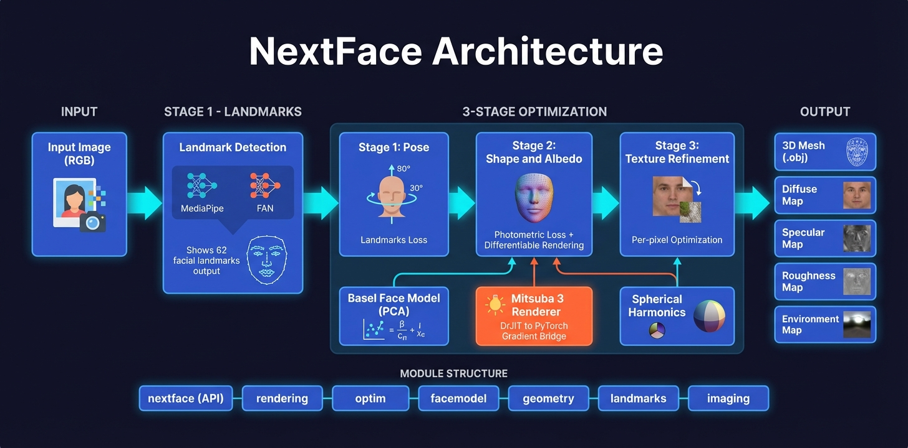

# NextGenFace Architecture

NextGenFace is a modular 3D face reconstruction system that reconstructs face geometry and reflectance from monocular images using differentiable ray tracing. Based on the original [NextFace](https://github.com/abdallahdib/NextFace) by Abdallah Dib; this port replaces PyRedner with Mitsuba 3.

---

## 1. System Overview

NextGenFace reconstructs 3D face geometry and reflectance from monocular images using differentiable ray tracing. The system uses a statistical morphable model (Basel Face Model 2017) and optimizes scene attributes through a 3-stage pipeline.

High-level flow:

```
Input Image → Landmark Detection → 3-Stage Optimization → 3D Face + Reflectance Maps
```

**What the system produces:**
- 3D mesh geometry (shape + expression coefficients)
- Per-vertex albedo / diffuse texture
- Specular and roughness texture maps
- Camera pose (rotation, translation, focal length)
- Spherical harmonics lighting coefficients

---

## 2. Module Architecture

<p align="center">
  
</p>

**Dependency direction:** `optim` depends on `rendering`, `facemodel`, `geometry`, `landmarks`, and `imaging`. `rendering` is self-contained. All subpackages are independent of each other except where explicitly imported.

---

## 3. Module Details

### `nextgenface/` — Public API & CLI

Thin package that re-exports the primary user-facing symbols from subpackages.

| File | Purpose |
|------|---------|
| `__init__.py` | Re-exports `Renderer`, `Pipeline`, `Optimizer`, `Config` |
| `cli.py` | CLI entry point (`nextgenface-reconstruct`), parses args, runs optimizer |
| `_version.py` | Package version string |

Users access the full system through:

```python
from nextgenface import Renderer, Pipeline, Optimizer, Config
```

---

### `rendering/` — Mitsuba 3 Rendering Engine

Implements the Mitsuba 3 scene construction and differentiable rendering pipeline. This is the primary porting target from PyRedner.

| File | Class / Function | Purpose |
|------|-----------------|---------|
| `renderer.py` | `Renderer` | Main renderer class. API-compatible drop-in for the original PyRedner renderer. Orchestrates scene building, forward rendering, and differentiable rendering. |
| `_variant.py` | `ensure_variant()` | Selects best available Mitsuba variant at runtime: `cuda_ad_rgb` > `llvm_ad_rgb` > `scalar_rgb` |
| `_camera.py` | `build_camera(focal, width, height)` | Creates Mitsuba perspective sensor dict with matching FOV formula |
| `_mesh.py` | `build_mesh(vertices, indices, normals, uvs)` | Creates `mi.Mesh` from PyTorch tensors |
| `_material.py` | `build_material(diffuse, specular, roughness)` | Creates Mitsuba principled BSDF with bitmap textures |
| `_envmap.py` | `build_envmap(envmap_tensor)` | Converts SH-generated environment maps to Mitsuba emitters |
| `_scene.py` | `build_scenes()` | Assembles complete Mitsuba scenes from all components; handles batch dimension and shared textures |
| `_forward.py` | `render_scenes()`, `render_albedo()` | Non-differentiable rendering; AOV integrator for albedo extraction |
| `_gradient_bridge.py` | `differentiable_render()` | Custom `torch.autograd.Function` bridging DrJit AD with PyTorch autograd |

**Integrators used:**

| Integrator | When Used | Why |
|-----------|-----------|-----|
| `direct_projective` | Differentiable rendering (Stages 2 & 3) | Supports silhouette gradients |
| `path` | Final output renders | High-quality multi-bounce lighting |
| `aov` | Albedo extraction | Isolates surface color from lighting effects |

---

### `facemodel/` — Basel Face Model

Loads and operates the Basel Face Model 2017 (BFM2017) statistical morphable model.

| File | Class | Purpose |
|------|-------|---------|
| `morphablemodel.py` | `MorphableModel` | Loads BFM2017 `.h5` file, computes shape/albedo from PCA coefficients, generates UV textures |
| `meshnormals.py` | `MeshNormals` | Computes per-vertex normals from the face mesh |
| `normalsampler.py` | `NormalSampler` | Samples normals in UV space |
| `_pickle_io.py` | — | Caching layer: loads `.h5` once, caches to `.pickle` for fast reload |

The morphable model expresses face shape and albedo as linear combinations of PCA basis vectors:

```
shape    = mean_shape + Σ (shape_coeff[i] * shape_basis[i])
albedo   = mean_albedo + Σ (albedo_coeff[i] * albedo_basis[i])
```

---

### `geometry/` — 3D Geometry & Projection

Handles camera transformations, pose estimation, spherical harmonics lighting, and mesh export.

| File | Class / Function | Purpose |
|------|-----------------|---------|
| `camera.py` | `Camera` | Transforms vertices between world and camera space using rotation/translation matrices |
| `projection.py` | `estimateCameraPosition()` | Estimates initial camera pose from landmarks using PnP-like optimization |
| `sphericalharmonics.py` | `SphericalHarmonics` | Converts SH coefficients to environment maps (pure PyTorch) |
| `obj_export.py` | `saveObj()` | Exports reconstructed mesh as `.obj` with `.mtl` material file |

---

### `landmarks/` — Face Landmark Detection

Detects 2D facial landmarks in input images. Two backends are available.

| File | Class | Points | Notes |
|------|-------|--------|-------|
| `fan.py` | `LandmarksDetectorFAN` | 62 | FAN-based detector |
| `mediapipe.py` | `LandmarksDetectorMediapipe` | 62 | MediaPipe Face Mesh; more stable in practice |
| `_viz.py` | — | — | Landmark visualization utilities |

Both detectors expose the same interface and produce 62-point landmark arrays compatible with the BFM2017 landmark index mapping.

---

### `imaging/` — Image Processing

Handles image loading, saving, and Gaussian smoothing used during optimization.

| File | Class / Function | Purpose |
|------|-----------------|---------|
| `image.py` | `Image`, `ImageFolder`, `saveImage()` | Loads single/batch images; `saveImage()` applies gamma correction. Replaces `pyredner.imwrite` with `cv2`. |
| `smoothing.py` | `GaussianSmoothing` | Gaussian blur applied to rendered images during Stage 2 optimization |

---

### `optim/` — Optimization Pipeline

Orchestrates the full 3-stage optimization. This module ties together all other subpackages.

| File | Class | Purpose |
|------|-------|---------|
| `config.py` | `Config` | Parses `.ini` config files (e.g., `default.ini`, `shadows.ini`) |
| `pipeline.py` | `Pipeline` | Orchestrates morphable model + renderer; manages scene parameters (shape coeffs, albedo coeffs, expression, rotation, translation, focals, SH coefficients, roughness) |
| `optimizer.py` | `Optimizer` | Runs 3-stage optimization; manages checkpoints and loss computation |
| `textureloss.py` | `TextureLoss` | Symmetry, consistency, and smoothness regularizers for Stage 3 |

---

## 4. Data Flow Through the Pipeline

### Input

RGB image(s) loaded into `Image`/`ImageFolder` tensors of shape `[N, H, W, 3]`.

### Step 1 — Landmark Detection

`LandmarksDetectorMediapipe` (or FAN) detects 62 2D facial landmarks.

**Output:** `[N, 62, 2]` pixel coordinates

### Step 2 — Stage 1 Optimization (Geometric Alignment, No Rendering)

Adam optimizes rotation, translation, and expression coefficients using only 2D landmark reprojection. No differentiable rendering is performed.

```
Loss = ||project(MorphableModel(shape_coeff, expr_coeff), camera) - landmarks||²
```

**Optimized parameters:** rotation (3), translation (3), expression coefficients (N_expr)

### Step 3 — Stage 2 Optimization (Photometric, Differentiable Rendering)

Full rendering pipeline activated.

1. `MorphableModel` computes vertices `[N, V, 3]` and albedos from PCA coefficients
2. `Camera` transforms vertices to camera space
3. `SphericalHarmonics` generates envmap `[N, H, W, 3]` from SH coefficients
4. `Renderer` builds Mitsuba scenes and renders `[N, H, W, 4]` images
5. Gradient bridge enables backpropagation through rendering
6. Loss computed and gradients flow back through the bridge into PyTorch

```
Loss = photometric_loss + landmark_loss + shape_regularization + albedo_regularization
```

**Optimized parameters:** shape coefficients, albedo coefficients, focals, SH coefficients, rotation, translation

### Step 4 — Stage 3 Optimization (Texture Refinement)

Directly optimizes diffuse/specular/roughness texture maps as free parameters. Same rendering pipeline but with per-pixel texture parameters.

```
Loss = photometric_loss + texture_symmetry + texture_smoothness + texture_consistency
```

**Optimized parameters:** diffuse texture map, specular texture map, roughness texture map

### Output

- Reconstructed mesh saved as `.obj` + `.mtl`
- Texture maps saved as images
- Intermediate checkpoints saved per stage

---

## 5. The Gradient Bridge (Key Innovation of the Port)

The core technical challenge in porting from PyRedner to Mitsuba 3 is bridging two incompatible AD frameworks.

### The Problem

| System | AD Framework | Tensor Type |
|--------|-------------|-------------|
| PyTorch (optimizer, loss) | `torch.autograd` | `torch.Tensor` |
| Mitsuba 3 (renderer) | DrJit | `dr.Array` / `mi.TensorXf` |

These systems cannot directly exchange gradients.

### The Solution: `_DiffRender` Custom Function

`differentiable_render()` in `_gradient_bridge.py` implements a `torch.autograd.Function` that manually manages the handoff.

**Forward pass:**

```
torch.Tensor (params)
  → numpy arrays
  → DrJit parameter update via mi.traverse()
  → mi.render() with direct_projective integrator
  → numpy array
  → torch.Tensor (rendered image)
```

**Backward pass:**

```
torch.Tensor (output gradient, dL/dI)
  → seed Mitsuba output grad
  → dr.traverse(scene, Backward)  ← DrJit computes dL/d(params) internally
  → extract per-parameter gradients from scene traversal
  → return as torch.Tensor gradients
```

### Parameter Paths Bridged

The following Mitsuba scene parameter paths are registered for gradient flow:

| Parameter Path | Description |
|---------------|-------------|
| `face_mesh.vertex_positions` | 3D vertex positions |
| `face_mesh.bsdf.base_color.data` | Diffuse albedo texture |
| `face_mesh.bsdf.roughness.data` | Roughness texture |
| `envmap.data` | Environment map from SH |

### Envmap Wrap-Around Handling

Mitsuba internally stores environment maps with an extra wrap-around column: `[H, W+1, 3]`. The gradient bridge strips this extra column when extracting gradients so that shapes match the PyTorch-side tensors `[H, W, 3]`.

---

## 6. Key Design Decisions

### Mitsuba 3 over PyRedner

PyRedner is no longer actively maintained. Mitsuba 3 is actively developed, has better BSDF support (principled BSDF with full parameter control), and provides a stable DrJit-based AD system designed for differentiable rendering research.

### principled BSDF

Mitsuba's principled BSDF cleanly separates:
- `base_color` — diffuse albedo (bitmap texture)
- `roughness` — surface roughness (bitmap texture)
- `specular` — specular reflectance (float, averaged from RGB channels)

This maps naturally to the BFM2017 albedo decomposition and allows Stage 3 to optimize each component independently.

### Integrator Selection

`direct_projective` is used for differentiable passes because it correctly computes silhouette gradients, which are critical for boundary-aware shape optimization. `path` produces higher quality output but is not used during optimization due to cost.

### Modular Package Structure

Each concern is isolated into its own package. Internal imports use bare package names:

```python
from rendering.renderer import Renderer   # correct
from src.rendering.renderer import Renderer  # wrong
```

This keeps inter-module dependencies explicit and prevents circular imports. The `nextgenface` package is intentionally thin — it only re-exports; it does not contain logic.

### Hatchling src-layout

Using `src/` prefix with Hatchling's build system ensures that the source tree is not importable without installation, preventing accidental imports of uninstalled code. Hatchling strips the `src/` prefix at install time, so `src/rendering` becomes the top-level `rendering` package.

---

## 7. Package Layout & Build System

```
pyproject.toml          # Hatchling build, dependencies, CLI entry point
src/
  nextgenface/          # Thin public API package
  rendering/            # Installed as top-level `rendering`
  facemodel/            # Installed as top-level `facemodel`
  geometry/             # Installed as top-level `geometry`
  landmarks/            # Installed as top-level `landmarks`
  imaging/              # Installed as top-level `imaging`
  optim/                # Installed as top-level `optim`
configs/
  default.ini           # Default optimization config
  shadows.ini           # Config variant with shadow support
scripts/
  reconstruct.py        # Standalone reconstruction script
  replay.py             # Replay saved optimization
tests/                  # 148 tests organized by feature
docs/
  demo.ipynb            # Jupyter notebook demo (updated for Mitsuba 3)
data/                   # Symlinks to NextFace/ model data (BFM2017, FAN weights)
```

### pyproject.toml package listing

Each subpackage is listed individually in `pyproject.toml`. Hatchling strips the `src/` prefix:

```toml
[tool.hatch.build.targets.wheel]
packages = [
  "src/nextgenface",
  "src/rendering",
  "src/facemodel",
  "src/geometry",
  "src/landmarks",
  "src/imaging",
  "src/optim",
]
```

### CLI Entry Point

```toml
[project.scripts]
nextgenface-reconstruct = "nextgenface.cli:main"
```

### Installation

```bash
uv pip install -e .
```

---

## 8. Testing Architecture

### Test Count and Organization

148 tests pass, 1 skipped. Tests are organized by feature area rather than by module, with descriptive names that document expected behavior.

### conftest.py

`tests/conftest.py` auto-detects Homebrew LLVM and sets `DRJIT_LIBLLVM_PATH` so that the `llvm_ad_rgb` Mitsuba variant works without manual environment setup on macOS.

### Test Geometry Conventions

Tests that exercise the rendering pipeline must respect Mitsuba's clip planes and winding conventions:

- **Depth placement:** Test geometry is placed at `z=50` (well beyond `clip_near=10.0`)
- **Winding order:** Face winding must produce normals facing the camera; incorrect winding causes zero gradients in differentiable rendering tests
- **Coordinate system:** Mitsuba uses right-handed coordinates with Y-up

### Test Categories

| Category | What Is Tested |
|----------|---------------|
| Rendering | Scene construction, forward render output shape and values |
| Gradient bridge | Gradient flow through `_DiffRender`, parameter path correctness |
| Pipeline stages | Stage 1 convergence, Stage 2 photometric loss decrease, Stage 3 texture update |
| Morphable model | PCA coefficient application, UV texture generation |
| Geometry | Camera transform, spherical harmonics envmap shape |
| Landmarks | Detector output shape, coordinate range |
| Imaging | Load/save round-trip, gamma correction |

### Running Tests

```bash
uv run pytest tests/ -v
```
